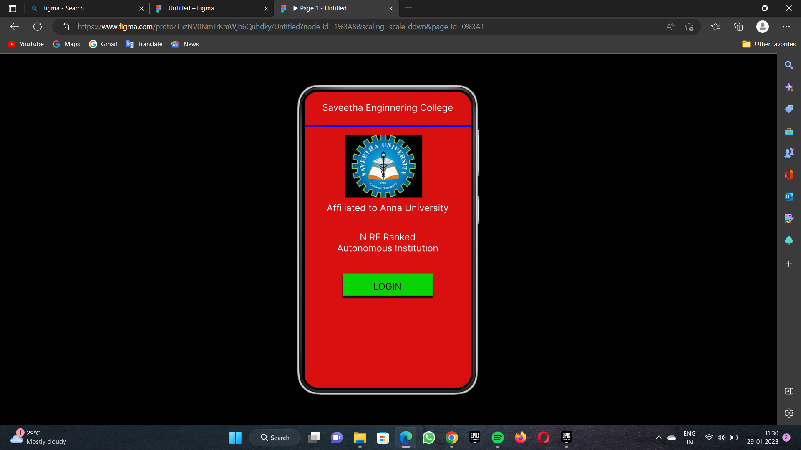
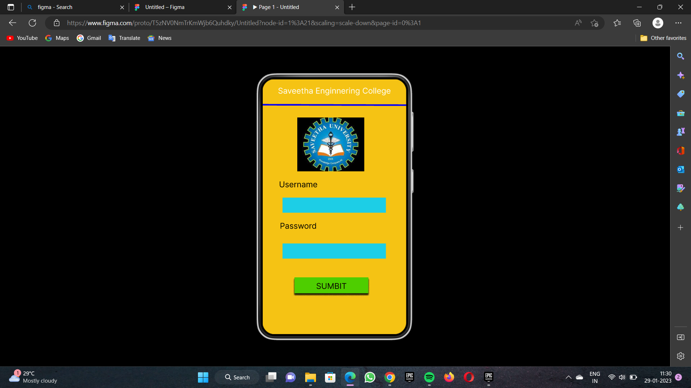
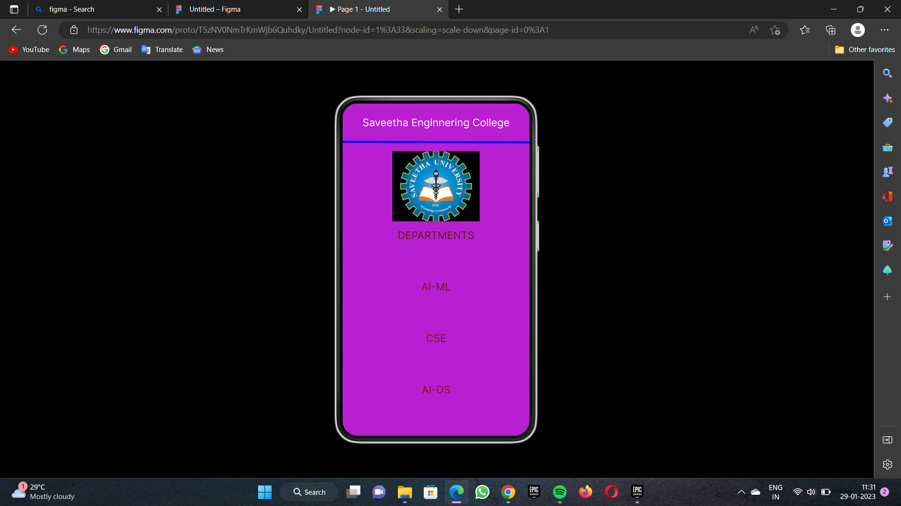

# Event Registration Web Application

## AIM:
To design, develop and deploy a web application for event registration.

## DESIGN STEPS:

### Step 1:


### Step 2:


### Step 3:


### Step 4:


### Step 5:

### Step 6:

Validate the HTML and CSS code.

### Step 6:

Publish the website in the given URL.

## DESIGN:

## PROGRAM :
```
/* Home Page */


position: relative;
width: 360px;
height: 640px;
background: #D81010;


/* Logic Page */


position: relative;
width: 360px;
height: 640px;
background: #F5C314;


/* SEC Page */


position: relative;
width: 360px;
height: 640px;
background: #B81FD0;

```

## OUTPUT:




## Result:
The program to design, develop and deploy a web application for event registration is completed successfully.
